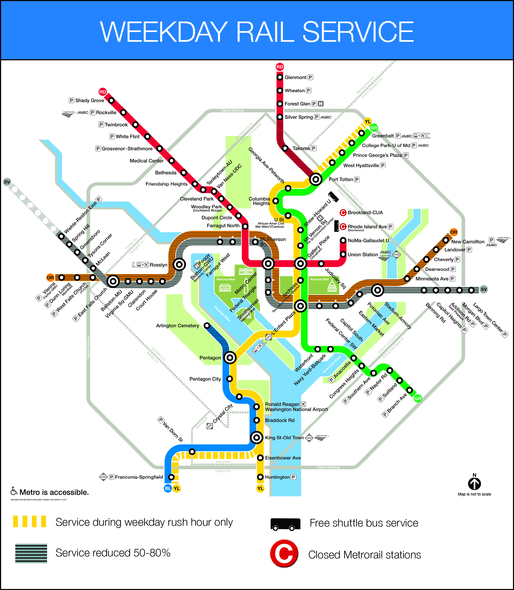

# ms-metro

Metro map is copied from [here](https://www.wmata.com/service/status/details/2018-Capital-Project-McPherson-Smithsonian-Advisory.cfm).

This project calls the [WMATA's API](https://developer.wmata.com/) for DC Metro information.

The project acts as an orchestration layer to retrieve information for specific metro lines.

## WMATA Endpoints

- Go to `/apis/wmata.js` for the actual WMATA API endpoints that are called.
- There is a link (in comment) above each one.
- In order to use the WMATA API's you have to create a (free) account.
- Once you've created an account, you'll use the `Primary key` value (seen in your profile) with all of your API requests.
- If you set your primary key as an environment variable, then the project can pull them in with `process.env.WMATA_API_SECRET_KEY`.

## Exposed API paths

`/station-list`

- Returns a list of the train stations with their address and other information. Requires the value `LineCode` as a query string with the request.
- This is the value the WMATA APIs use to determine which line to retrieve values for. Acceptable values are `RD, BL, YL, OR, GR, or SV`.

`/stationInformation`

- Retruns information specific to the `StationCode` provided.
- Call the `/station-list` endpoint to get a list of possible station code values.

`/station-hours`

- Returns the opening, first train, and last train times for the station specified.
- Call the `/station-list` endpoint to get a list of possible station code values.

`/arrival-times`

- Returns the predicted arrival times for the specific station requested.
- Call the `/station-list` endpoint to get a list of possible station code values.

`/station-route`

- returns an ordered list of stations visited for the line specified. Acceptable values are `RD, BL, YL, OR, GR, or SV`.

## Development

This project has npm scripts that help you to run it locally.

- `npm run start` starts the app locally on port `1122`.
- `npm run develop` starts the app with nodemon on port `1122` so it does hot reloading of any changes.
- `npm run unit-tests` runs the unit tests.
- `npm run integration-mock-run-local` runs the integration tests locally with `json-server`.
- `npm run integration-mock-run-ci` runs the integration tests on ci with `json-server`.

## Unit Tests

- Unit tests are done using [chai expect](https://www.chaijs.com/guide/styles/) and [sinon](https://sinonjs.org/releases/latest/stubs/).
- Unit tests are located at `test/unit.js`.
- To run unit tests use the npm script with `npm run unit-tests`.
- Mock values used by the unit tests are stored at `mocks/metro` and `mocks/wmata`.
- Unit tests focus on the controllers at `controllers/metro.js`.

## Integration Tests

- Integration tests are done with [json-server](https://www.npmjs.com/package/json-server).
- Integration tests use [chai http](https://www.chaijs.com/plugins/chai-http/) to run the app locally, and then using the environment variable `MOCK_SERVER` the `json-server` returns mock responses for all external HTTP calls.
- In order to have the `json-server` running alongside the application for local tests, this project uses [concurrently](https://www.npmjs.com/package/concurrently).
- In order to have the `json-server` running alongside the application for CI tests, this project uses [start-server-and-test](https://www.npmjs.com/package/start-server-and-test).
- Mocks used by the json-server are stored at the `mock-server` folder.

## Future Improvements

- PRs are always welcome!
- Feel free to reach out to me on Twitter at [@AndrewEvans0102](https://twitter.com/andrewevans0102)
